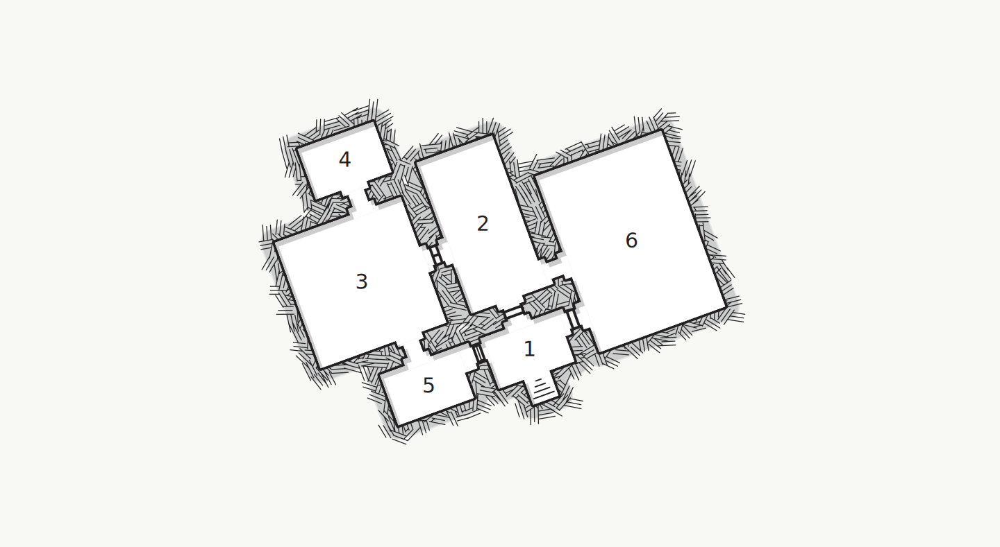

## Lost in the Dark
A small tiefling child stumbles into the tavern a little before closing time. The child is named **Madeg** and earlier that day she was playing in the sewer with her little brother, **Arron**. The two were separated when a giant sewer rat attacked. Madeg needs help finding her little brother and is too scared to go back alone. She doesn't want to ask her parents because she doesn't want both of them to get punished.

### Hook
>You notice a small tiefling child squeezing in through the door.
>
>The girl has noticeable filth on her dark brown hair and stains of varying color cover her dress in uneven patches. A distinct stench of rot and decay emenate from her as she made her way past the tables and diners. As she moved through the tavern she asks any one she comes across for help. Most ignore her, some, visibily disgusted at her appearance, leave.
>
>For a second your eyes meet and she begins to head in your direction. She stops just short of you, almost aware of her current condition, and asks politely for your help...
{.read}

### Madeg's predicament
The tiefling child introduces herself as Madeg and spares no time in explaining the situation. She is worried about the wellbeing of her brother and asks the characters to help her find him in the sewers.

Madeg explains how her and her little brother got separated with in the sewers, and will agree to show the characters to the sewer entrance she used. Madeg, however, will not enter the sewers due to the tramua she experienced earlier that day.

If the characters refuse to help Madeg, she leaves in tears and her brother is never seen again. Days later, news of the characters refusal to help the child spreads throughout the city and their reputation suffers from it.

## Sewers Interior
The following areas correspond to the labels on the provided map.

### 1. Entrance Room
No matter how hard they try, the smell of sewage seeps into the nose of anyone that enters this room.

There is a garbage and trash piled into the center of the room. A hole in the ceiling sits directly over the pile of refuse.

The room has two doors leading outwards. They are both shut. One door sits on the eastern wall and the other on the western wall.

A grated door stands to the north. Water from the flooded room (area 4) seeps through the door and into the entrance room. It is too dark to see into the room on the other side of this door.

The grated door is operated via a system of pulls and can only be opened by being pushed and held up off the ground. A crank sits next to the left of the door. It is stuck and a character succeeding a DC 10 Strength (Athletics) check is able to force it to turn, opening the eastern door. A character beating a DC 14 Strength (Athletics) check may hold the door up long enough for everyone to move through it.

### 2. Empty Room
In the center of the room is a large pile of garbage. A swarm of rats is hidden within it. The rats attack if any characters inspect or approaches the pile of rubbish.

The door to the north of the room is close but not locked.

### 3. Big Empty Room
There are more piles of garbage in this room. The smell of rotting meat and feces in this rooms makes the characters want to vomit. Characters entering this room must succeed a DC 10 Constitution saving throw or vomit.

Four giant rats have made their home here and when a character enters the center of the room, or makes a loud noise, the rats pour out to defend their home.

This room opens to a smaller room to the north.

A door to the east is shut and closes off the room.

### 4. Flooded Room
The walls to this room are surprisingly clean. Aside from the sewer water leaking onto the floor, this room is unnecessarily tidy.

As the characters explore, an ooze rises from the murky water and attacks. A character must succeed a DC 15 passive Wisdom (Perception) check to notice the ooze before it strikes.

### 5. Abandoned Alchemist Lab
Junk and trash are scattered all around the room making it difficult for the characters to see where they are going. Characters moving in this room must succeed a DC 10 Dexterity saving throw or take 1d4 piercing damage from the hidden debris.

Arron stands on a small alchemy table, he is clutching a small club and is surprised to see the characters. The two rats that had him cornered are hidden in the corners of the room. As soon as the characters enter the rats attack.

The alchemy table has miscellaneous ingredients that are too wasted away to be of use.

### 6. Dilapidated Temple
The room is filled with sharp debris and trash, characters moving in this room must succeed a DC 10 Dexterity saving throw or take 1d4 piercing damage from the hidden debris.

An altar sits against the northern wall. The candles stationed on it have long since gone out. A chest is hidden under the altar.

The chest contains 10d6 gp and a book written in an unknown language.

### Map

## Conclusion
Once reunited, Madeg and Arron thank you profusely for your help. The two promise to never go back to the sewers again and immediately return home. You find out later that they had both gotten scolded by their parents for going into the sewers because they had returned home reeking of sewage.